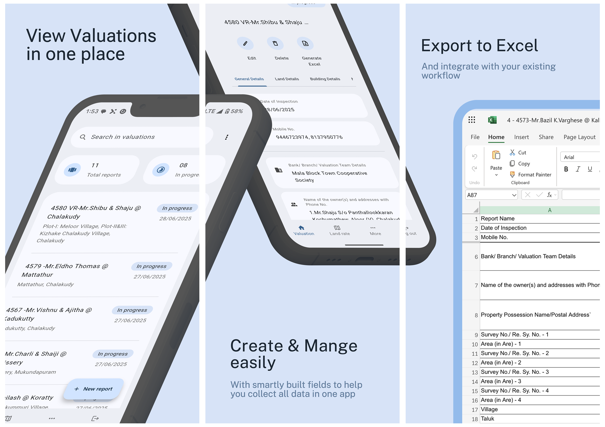

<!-- 
 -->

# ValuatorX
<!-- 
 -->

**ValuatorX** is a Flutter app built for my father's construction consultancy, [Samanto Associates Pvt. Ltd.](https://samanto.in/) to streamline the process of creating and managing property valuation reports. It also includes a set of tools and shortcuts that support their workflow, making it the ideal starting point for their work.

Try it out: 
- [Download on Google Play](https://play.google.com/store/apps/details?id=in.samanto.valuatorx) (closed beta)
- [Access the Web App](https://samanto-valuatorx.web.app/login) (login requires access to Samanto Microsoft organization)

## Screenshots

## Technologies Used

| Tech | Purpose |
|------|---------|
| [Flutter](https://flutter.dev/) | Cross-platform frontend (mobile + web) |
| [Microsoft Graph API](https://developer.microsoft.com/en-us/graph/graph-explorer) | Reads/writes to online Excel spreadsheets for data storage |
| [Hive](https://github.com/isar/hive) | Auto-save local draft system |

